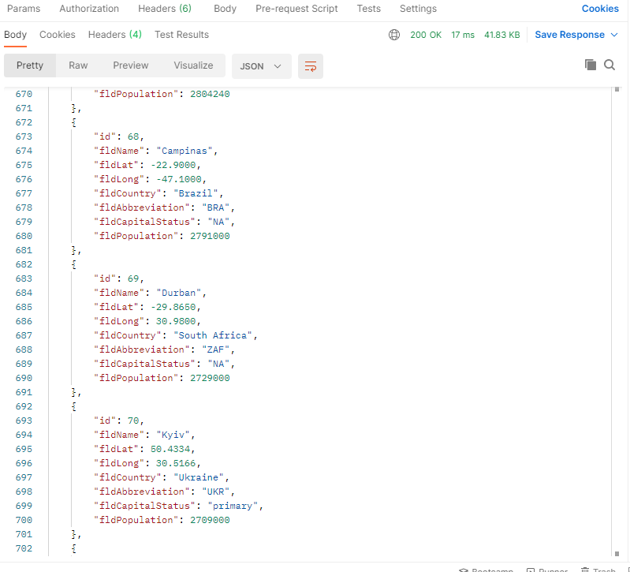
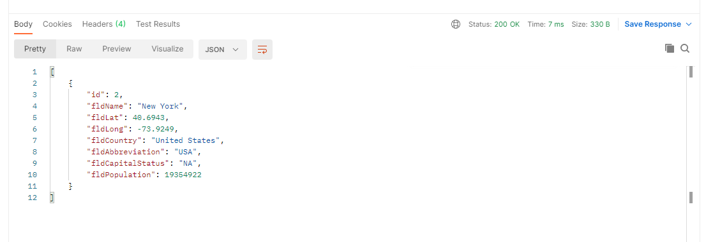
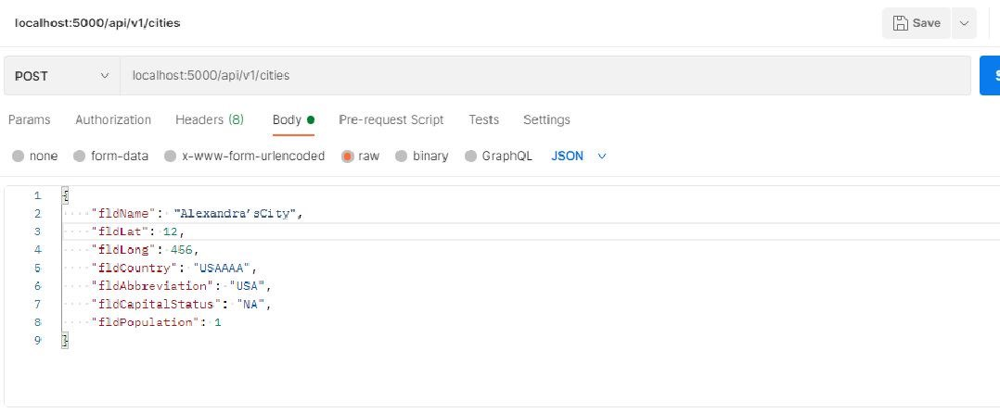
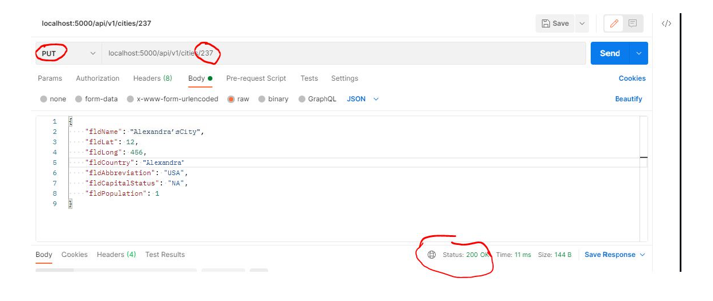
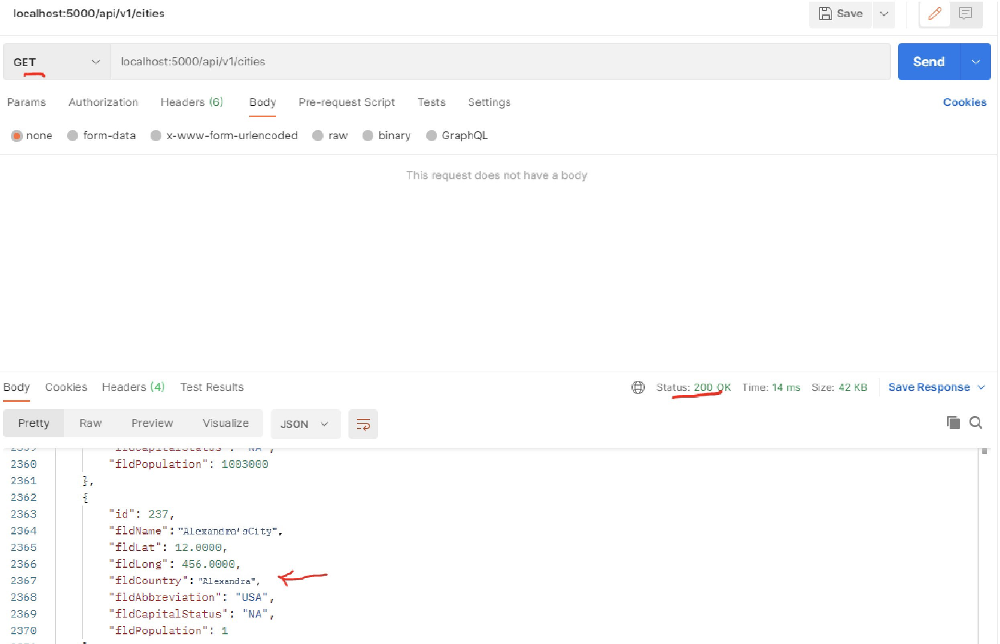
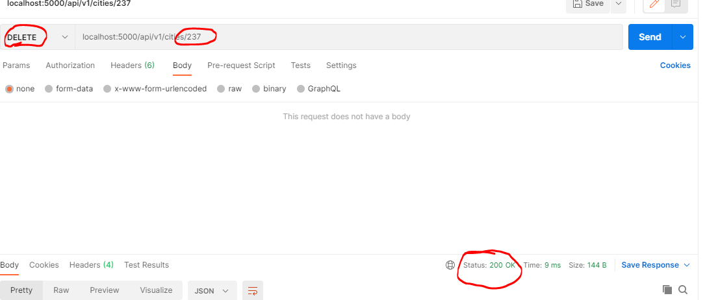

# Project Description
This project is a homework assignment to teach how to get Pycharm setup with Docker, Flask, MySQL, and Postman

View the first repository in this collection (no flask yet) by clicking on [First Part of Assignment](https://github.com/af428/PythonDockerFlaskPycharm)

## List of records
* 

## Get request record
* 

## Create new city
* 

## New city in list
* 

## Edit record with PUT
* 

## Edit record in list
* 

## Delete record (DELETE)
* 

## List with record deleted
* 

