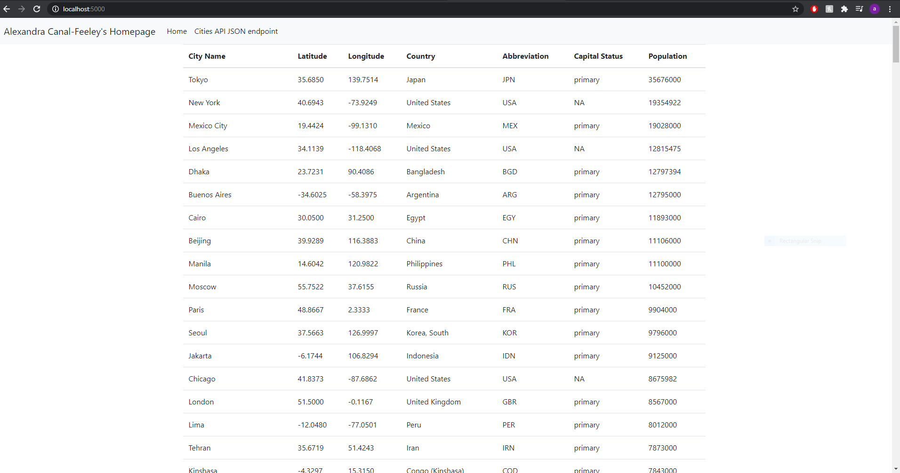
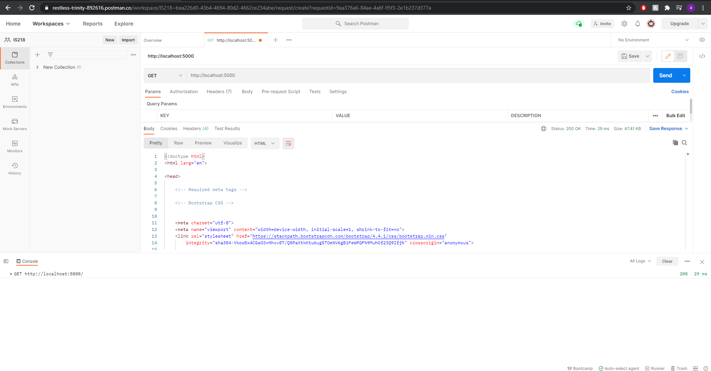
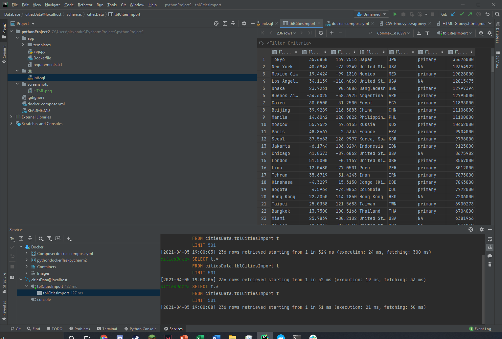
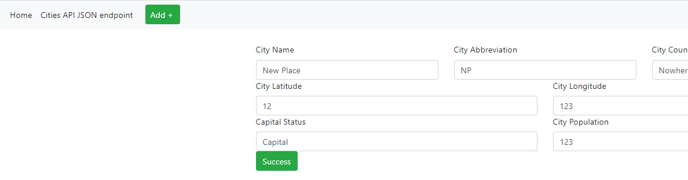
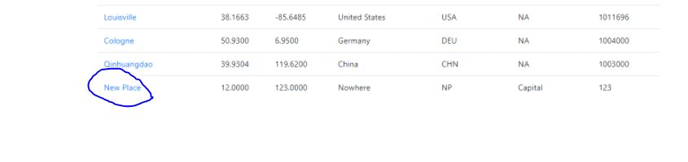
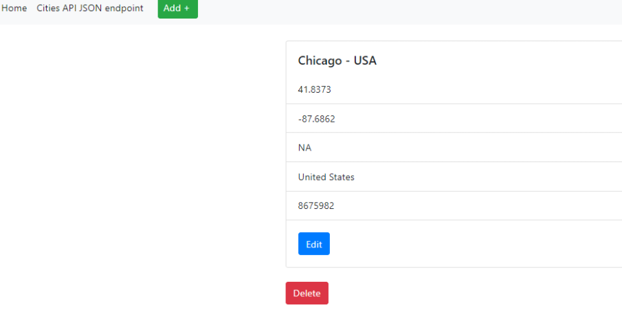

# Project Description
This project is a homework assignment to teach how to get Pycharm setup with Docker, Flask, MySQL, and Postman

View the first repository in this collection (no flask yet) by clicking on [First Part of Assignment](https://github.com/af428/PythonDockerFlaskPycharm)
## Flask Template Screenshot
* 

## Postman Screenshot
* 

## SQL Screenshot
* 

## New Screenshot
* 

## New Added Screenshot
* 

## View Screenshot
* 

